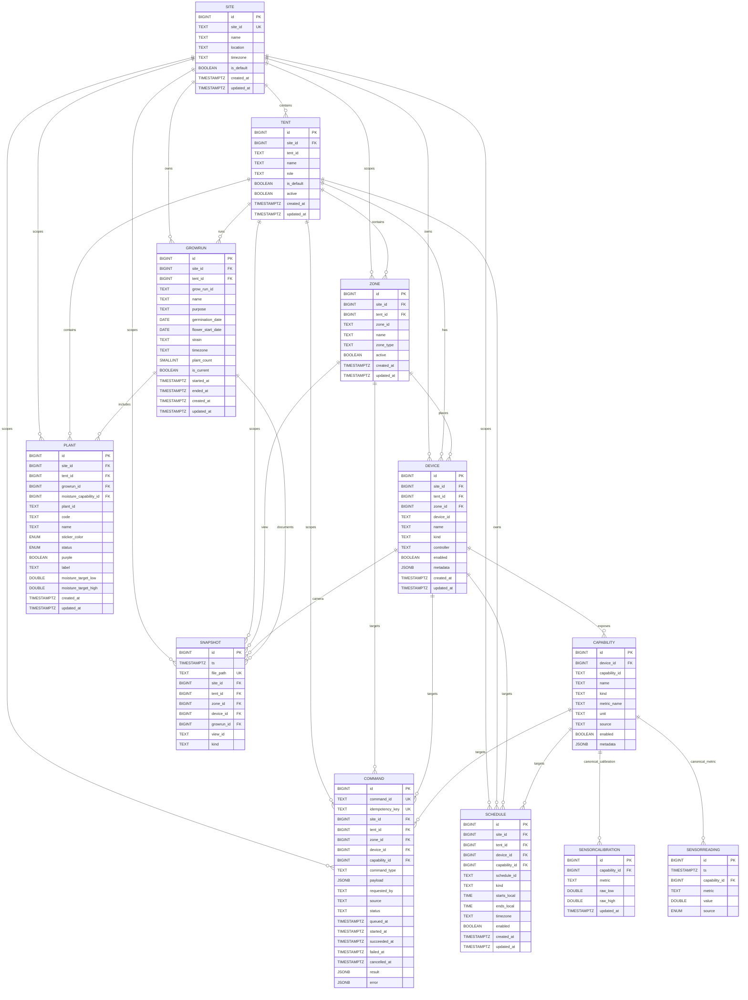

# Multi-Tent Data Model ERD

This document describes the Phase 1 multi-tent local controller database model implemented by `docs/epics/multi-tent-controller/ExecPlan.md`.

The canonical scoped telemetry path is:

`site -> tent -> zone/device -> capability -> sensorreading`

Firmware ingest, plant moisture, calibration, and current reads all use scoped device/capability identity. The final legacy cleanup migration removes `sensornode`, `sensor_location`, and `sensorreading.sensornode_id` after converting the approved historical rows.

## Relationship Diagram

## Object And Field Catalog

### `site`

Physical local controller installation. Phase 1 seeds `site_id='homebox'`.

| Field | Type | Key / FK | Notes |
| --- | --- | --- | --- |
| `id` | `bigint` | PK | Surrogate identity. |
| `site_id` | `text` | Unique | Stable public/local identifier. |
| `name` | `text` |  | Display name. |
| `location` | `text` nullable |  | Human location label. |
| `timezone` | `text` |  | Defaults to `America/Denver`. |
| `is_default` | `boolean` |  | Default scope selector. |
| `created_at` | `timestamptz` |  | Creation timestamp. |
| `updated_at` | `timestamptz` |  | Update timestamp. |

### `tent`

Logical grow tent at a site. Phase 1 seeds `main` and `breeding`.

| Field | Type | Key / FK | Notes |
| --- | --- | --- | --- |
| `id` | `bigint` | PK | Surrogate identity. |
| `site_id` | `bigint` | FK -> `site.id` | Parent site. |
| `tent_id` | `text` | Unique with `site_id` | Stable tent identifier. |
| `name` | `text` |  | Display name. |
| `role` | `text` |  | Example: `flower`, `breeding`. |
| `is_default` | `boolean` | Partial unique per site | Default tent for unscoped compatibility. |
| `active` | `boolean` |  | Whether the tent is active in the catalog. |
| `created_at` | `timestamptz` |  | Creation timestamp. |
| `updated_at` | `timestamptz` |  | Update timestamp. |

### `zone`

Logical area within a tent or site.

| Field | Type | Key / FK | Notes |
| --- | --- | --- | --- |
| `id` | `bigint` | PK | Surrogate identity. |
| `site_id` | `bigint` | FK -> `site.id` | Parent site. |
| `tent_id` | `bigint` nullable | FK -> `tent.id` | Nullable for site-level zones. |
| `zone_id` | `text` | Unique with `site_id`, `tent_id` | Stable zone identifier such as `canopy` or `plant-a`. |
| `name` | `text` |  | Display name. |
| `zone_type` | `text` |  | Logical type such as `plant`, `canopy`, `reservoir`. |
| `active` | `boolean` |  | Whether the zone is active in the catalog. |
| `created_at` | `timestamptz` |  | Creation timestamp. |
| `updated_at` | `timestamptz` |  | Update timestamp. |

### `device`

Physical or locally controlled device. Devices can belong to a tent, a zone, or be site-level.

| Field | Type | Key / FK | Notes |
| --- | --- | --- | --- |
| `id` | `bigint` | PK | Surrogate identity. |
| `site_id` | `bigint` | FK -> `site.id` | Parent site. |
| `tent_id` | `bigint` nullable | FK -> `tent.id` | Nullable for site-level devices such as voice hardware. |
| `zone_id` | `bigint` nullable | FK -> `zone.id` | Optional placement. |
| `device_id` | `text` | Unique with `site_id` | Stable device identifier. |
| `name` | `text` |  | Display name. |
| `kind` | `text` |  | Device category. |
| `controller` | `text` |  | Local controller/integration owner. |
| `enabled` | `boolean` |  | Whether the device is enabled. |
| `metadata` | `jsonb` |  | SQLModel field name is `metadata_json`; DB column is `metadata`. |
| `created_at` | `timestamptz` |  | Creation timestamp. |
| `updated_at` | `timestamptz` |  | Update timestamp. |

### `capability`

Metric or action exposed by a device.

| Field | Type | Key / FK | Notes |
| --- | --- | --- | --- |
| `id` | `bigint` | PK | Surrogate identity. |
| `device_id` | `bigint` | FK -> `device.id` | Parent device. |
| `capability_id` | `text` | Unique with `device_id` | Stable capability identifier. |
| `name` | `text` |  | Display name. |
| `kind` | `text` |  | Example: sensor metric, actuator, camera action. |
| `metric_name` | `text` nullable |  | Sensor metric name when the capability emits readings. |
| `unit` | `text` nullable |  | Unit label where applicable. |
| `source` | `text` nullable |  | Source/integration label. |
| `enabled` | `boolean` |  | Whether the capability is enabled. |
| `metadata` | `jsonb` |  | SQLModel field name is `metadata_json`; DB column is `metadata`. |

### `growrun`

One grow cycle or breeding run in one tent.

| Field | Type | Key / FK | Notes |
| --- | --- | --- | --- |
| `id` | `bigint` | PK | Surrogate identity. |
| `site_id` | `bigint` | FK -> `site.id` | Parent site. |
| `tent_id` | `bigint` | FK -> `tent.id` | Parent tent. |
| `grow_run_id` | `text` | Unique with `tent_id` | Stable grow-run identifier. |
| `name` | `text` |  | Display name. |
| `purpose` | `text` |  | Example: production flower, breeding. |
| `germination_date` | `date` nullable |  | Germination date. |
| `flower_start_date` | `date` nullable |  | Flower flip date. |
| `strain` | `text` nullable |  | Strain label. |
| `timezone` | `text` |  | Local timezone for schedule/grow-stage math. |
| `plant_count` | `smallint` |  | Number of plants in the run. |
| `is_current` | `boolean` | Partial unique per tent | Current run flag scoped to one tent. |
| `started_at` | `timestamptz` nullable |  | Start timestamp. |
| `ended_at` | `timestamptz` nullable |  | End timestamp. |
| `created_at` | `timestamptz` |  | Creation timestamp. |
| `updated_at` | `timestamptz` |  | Update timestamp. |

### `plant`

Plant within a grow run.

| Field | Type | Key / FK | Notes |
| --- | --- | --- | --- |
| `id` | `bigint` | PK | Surrogate identity. |
| `site_id` | `bigint` | FK -> `site.id` | Parent site. |
| `tent_id` | `bigint` | FK -> `tent.id` | Parent tent. |
| `growrun_id` | `bigint` | FK -> `growrun.id` | Parent grow run. |
| `moisture_capability_id` | `bigint` nullable | FK -> `capability.id` | Canonical soil-moisture stream for current reads. |
| `plant_id` | `text` | Unique with `growrun_id` | Stable plant identifier within a grow run. |
| `code` | `text` |  | Current main-tent values are `a` through `d`. |
| `name` | `text` |  | Display name. |
| `sticker_color` | `plant_sticker` |  | Sticker enum. |
| `status` | `plant_status` |  | Plant lifecycle/status enum. |
| `purple` | `boolean` |  | Legacy/display flag. |
| `label` | `text` nullable |  | Optional label. |
| `moisture_target_low` | `double precision` |  | Moisture lower target. |
| `moisture_target_high` | `double precision` |  | Moisture upper target. |
| `created_at` | `timestamptz` |  | Creation timestamp. |
| `updated_at` | `timestamptz` |  | Update timestamp. |

### `sensorreading`

Append-only telemetry facts. Scope comes from `capability_id -> capability.device_id -> device.tent_id`.

| Field | Type | Key / FK | Notes |
| --- | --- | --- | --- |
| `id` | `bigint` | PK | Surrogate identity. |
| `ts` | `timestamptz` | Indexed | Reading timestamp. |
| `capability_id` | `bigint` | FK -> `capability.id` | Canonical scoped metric owner. |
| `metric` | `text` | Indexed with `ts` | Metric name as emitted/stored. |
| `value` | `double precision` |  | Reading value. |
| `source` | `sensor_source` |  | Source enum. |

### `sensorcalibration`

Two-point raw sensor calibration. Ownership is `capability_id`.

| Field | Type | Key / FK | Notes |
| --- | --- | --- | --- |
| `id` | `bigint` | PK | Surrogate identity. |
| `capability_id` | `bigint` | FK -> `capability.id` | Canonical scoped calibration owner. |
| `metric` | `text` | Unique with `capability_id` | Metric being calibrated. |
| `raw_low` | `double precision` |  | Lower raw calibration value. |
| `raw_high` | `double precision` |  | Upper raw calibration value; checked to be `>= raw_low`. |
| `updated_at` | `timestamptz` |  | Update timestamp. |

### `snapshot`

Camera image metadata for periodic captures and daily-report photos.

| Field | Type | Key / FK | Notes |
| --- | --- | --- | --- |
| `id` | `bigint` | PK | Surrogate identity. |
| `ts` | `timestamptz` |  | Capture timestamp. |
| `file_path` | `text` | Unique | Relative/local image path. |
| `site_id` | `bigint` nullable | FK -> `site.id` | Scoped site. |
| `tent_id` | `bigint` nullable | FK -> `tent.id` | Scoped tent. |
| `zone_id` | `bigint` nullable | FK -> `zone.id` | View/plant zone. |
| `device_id` | `bigint` nullable | FK -> `device.id` | Camera device. |
| `growrun_id` | `bigint` nullable | FK -> `growrun.id` | Grow run documented by the image. |
| `view_id` | `text` |  | Preset/view such as `overview` or `plant_a`. |
| `kind` | `text` |  | Example: `periodic`, `daily_report`. |

### `schedule`

Scoped local schedule row, currently used for the main lights photoperiod projection.

| Field | Type | Key / FK | Notes |
| --- | --- | --- | --- |
| `id` | `bigint` | PK | Surrogate identity. |
| `site_id` | `bigint` | FK -> `site.id` | Parent site. |
| `tent_id` | `bigint` | FK -> `tent.id` | Parent tent. |
| `device_id` | `bigint` nullable | FK -> `device.id` | Optional target device. |
| `capability_id` | `bigint` nullable | FK -> `capability.id` | Optional target capability. |
| `schedule_id` | `text` | Unique with `tent_id` | Stable schedule identifier. |
| `kind` | `text` |  | Schedule category. |
| `starts_local` | `time` nullable |  | Local start time. |
| `ends_local` | `time` nullable |  | Local end time. |
| `timezone` | `text` |  | Schedule timezone. |
| `enabled` | `boolean` |  | Whether the schedule is enabled. |
| `created_at` | `timestamptz` |  | Creation timestamp. |
| `updated_at` | `timestamptz` |  | Update timestamp. |

### `command`

Local command-intent and lifecycle ledger. This records locally accepted commands; this box remains the hardware authority.

| Field | Type | Key / FK | Notes |
| --- | --- | --- | --- |
| `id` | `bigint` | PK | Surrogate identity. |
| `command_id` | `text` | Unique | Stable command identifier. |
| `idempotency_key` | `text` | Unique | Prevents duplicate command creation. |
| `site_id` | `bigint` | FK -> `site.id` | Scoped site. |
| `tent_id` | `bigint` nullable | FK -> `tent.id` | Scoped tent when applicable. |
| `zone_id` | `bigint` nullable | FK -> `zone.id` | Target zone when applicable. |
| `device_id` | `bigint` nullable | FK -> `device.id` | Target device when applicable. |
| `capability_id` | `bigint` nullable | FK -> `capability.id` | Target capability when applicable. |
| `command_type` | `text` |  | Action type, such as PTZ movement. |
| `payload` | `jsonb` |  | Command payload. |
| `requested_by` | `text` |  | Local actor/user label. |
| `source` | `text` |  | Command source; non-local execution is not part of Phase 1. |
| `status` | `text` |  | Lifecycle state. |
| `queued_at` | `timestamptz` |  | Enqueue timestamp. |
| `started_at` | `timestamptz` nullable |  | Execution start timestamp. |
| `succeeded_at` | `timestamptz` nullable |  | Success timestamp. |
| `failed_at` | `timestamptz` nullable |  | Failure timestamp. |
| `cancelled_at` | `timestamptz` nullable |  | Cancellation timestamp. |
| `result` | `jsonb` nullable |  | Success result payload. |
| `error` | `jsonb` nullable |  | Failure payload. |

## Notes

- `sensornode`, `sensor_location`, and `sensorreading.sensornode_id` are retired by the scoped firmware legacy cleanup migration. Historical `reservoir_depth_cm` rows are normalized into `reservoir_in`; known trash `pressure_hpa` and one-off plant-a `humidity_pct` null-capability rows are discarded after the normal pre-apply `pg_dump`.
- `plant.sensornode_id` was retired in the legacy-compatibility cleanup; plant moisture is owned by `plant.moisture_capability_id`.
- `sensorcalibration.sensornode_id` was retired in the legacy-compatibility cleanup; calibration rows are capability-owned.
- `snapshot` scope columns are nullable because older image rows and some transition paths may predate scoped metadata.
- `zone.tent_id` and `device.tent_id` are nullable to support site-level zones/devices. For example, site-level voice hardware should not be forced into `homebox/main`.
